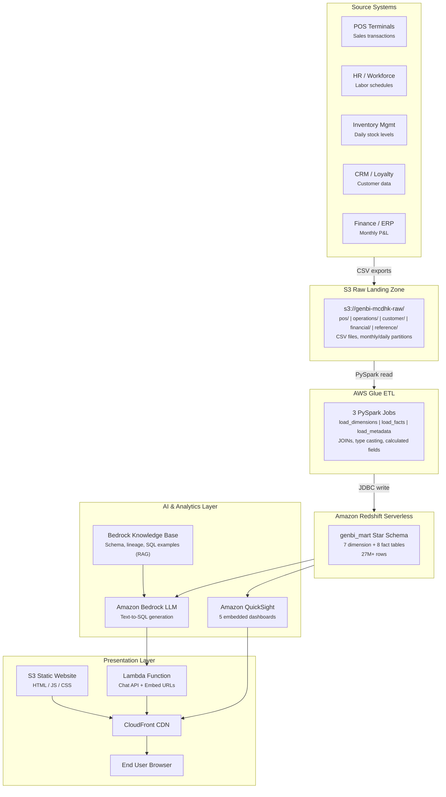

# BI Report Chatbot

## The Problem

Modern enterprises generate dashboards at scale — but more dashboards don't mean better decisions. Business users face three persistent challenges:

1. **Too many dashboards, too little insight** — Organizations often maintain dozens of dashboards across sales, operations, finance, and customer analytics. Finding the right dashboard for a specific question is a challenge in itself.
2. **Numbers without context** — A dashboard shows "Total Orders: 7,462,065" but doesn't explain what's included, what's excluded, or how the number was calculated. Is it line items or distinct transactions? Does it include voided orders? Which stores are in scope?
3. **Opaque data pipelines** — The journey from source system to dashboard metric involves multiple transformations (ETL jobs, JOINs, aggregations, filters). When a number looks wrong, tracing it back to the raw data requires tribal knowledge that lives in people's heads, not in the tool.

## The Solution

This platform solves all three problems by combining **interactive BI dashboards** with an **AI-powered chatbot** that answers business questions in plain English — and for every answer, traces the **complete data lineage** from source system to final metric.


*QuickSight dashboards with embedded GenBI chatbot — ask questions, get SQL-backed answers with full data lineage*


*Natural language question → SQL generation → Redshift query → results with end-to-end pipeline tracing*

### Key Capabilities

- **5 interactive dashboards** — Executive Summary, Sales & Menu, Operations, Customer Intelligence, Financial Performance
- **Natural language queries** — "What is the total revenue by region?" or "Which menu items have the highest profit margin?"
- **SQL-backed answers** — The chatbot generates SQL, queries Redshift, and returns tabular results with timing
- **End-to-end data lineage** — Every answer traces: Source System → S3 Raw → Glue ETL transforms → Redshift data mart → Dashboard aggregation
- **Smart dashboard routing** — The chatbot recommends the most relevant dashboard for each question
- **Topic guardrails** — The chatbot only responds to restaurant operations questions

---

## Architecture



> Open [`architecture-diagram.html`](architecture-diagram.html) locally in a browser for a detailed interactive version of this diagram.

### Technology Stack

| Layer | Service | Purpose |
|-------|---------|---------|
| **Frontend** | HTML5, CSS3, JavaScript, Chart.js | Dashboard UI, chat interface |
| **CDN** | Amazon CloudFront | Global content delivery, HTTPS |
| **Static Hosting** | Amazon S3 | HTML/JS/CSS files |
| **API Backend** | AWS Lambda + Function URL | Chat API, QuickSight embed URL generation |
| **AI/ML** | Amazon Bedrock LLM | Natural language to SQL generation (model-agnostic) |
| **Knowledge Base** | Amazon Bedrock KB | RAG retrieval for schema, lineage, SQL examples |
| **Data Warehouse** | Amazon Redshift Serverless | Star schema analytics (27M+ rows) |
| **ETL** | AWS Glue (PySpark) | S3 CSV to Redshift transformation |
| **Dashboards** | Amazon QuickSight | 5 embedded interactive dashboards |
| **Raw Storage** | Amazon S3 | CSV data files (POS, operations, financial, customer) |

---

## Getting Started

### Prerequisites

Before deploying, ensure the following are in place:

| Requirement | Details |
|-------------|---------|
| **AWS Account** | With permissions for Redshift, Glue, Bedrock, S3, Lambda, CloudFront |
| **Amazon QuickSight** | Enterprise edition with embedding enabled (required for dashboard embedding) |
| **Amazon Bedrock** | Model access enabled for your chosen LLM (e.g., Anthropic Claude, Amazon Titan) |
| **Python 3.9+** | For data generation scripts and local development |
| **AWS CLI v2** | Configured with appropriate credentials |
| **Raw Data** | Must be generated locally first — see Step 1 below |

### Step 1: Generate Raw Data

> The `genbi/raw/` directory is excluded from this repository (~2.4 GB). You must generate the raw data locally before proceeding.

```bash
git clone https://github.com/danielpeggy/bi-report-chatbot.git
cd bi-report-chatbot

# Generate POS transaction data
python3 generate_data.py

# Generate all domain data
cd genbi
python3 generate_pos.py              # POS transactions (monthly partitions)
python3 generate_operations.py       # Inventory, labor, service times, equipment
python3 generate_market_financial.py  # Competitor pricing, store P&L
python3 generate_customer.py          # Customer profiles, feedback, loyalty
python3 generate_reference.py         # Stores, menu items, channels, payments, promotions
```

All data is synthetically generated with seed 42 (fully reproducible). Patterns include seasonal variation, geographic differences, temporal peaks, supply chain volatility, and realistic equipment failure rates.

### Step 2: Upload Raw Data to S3

```bash
# Create your S3 bucket (or use existing)
aws s3 mb s3://YOUR-BUCKET-NAME

# Upload generated data
aws s3 sync genbi/raw/ s3://YOUR-BUCKET-NAME/ --exclude "*.DS_Store"
```

### Step 3: Set Up Amazon Redshift Serverless

1. Create a serverless workgroup (e.g., `demo-sales-related`)
2. Create database `dev` with schema `genbi_mart`
3. Run the SQL scripts from [`sql/`](sql/) to create tables and load dimension data

### Step 4: Run AWS Glue ETL Jobs

Upload the PySpark scripts from [`genbi/etl/`](genbi/etl/) as Glue jobs:

1. **load_dimensions** ([`load_dimensions.py`](genbi/etl/load_dimensions.py)) — Loads 7 dimension tables from S3 → Redshift
2. **load_facts** ([`load_facts.py`](genbi/etl/load_facts.py)) — Loads 8 fact tables with JOINs, calculated fields, type casting
3. **load_metadata** ([`load_metadata.py`](genbi/etl/load_metadata.py)) — Loads ETL registry, column-level lineage, and data dictionary

### Step 5: Set Up Amazon Bedrock Knowledge Base

1. Create a Bedrock Knowledge Base pointing to the 6 markdown files in [`genbi/kb_docs/`](genbi/kb_docs/)
2. Upload the KB docs to your S3 bucket: `aws s3 sync genbi/kb_docs/ s3://YOUR-BUCKET-NAME/kb_docs/`
3. Configure the KB with Amazon OpenSearch Serverless as the vector store
4. Run a sync/ingestion job to index the documents

### Step 6: Set Up Amazon QuickSight

1. Create 5 dashboards in QuickSight (Executive Summary, Sales & Menu, Operations, Customer Intelligence, Financial Performance)
2. Connect each dashboard to the appropriate Redshift datasets
3. Configure embedding: generate an embed URL for registered users
4. Note the dashboard IDs for the API configuration

### Step 7: Deploy the Application

**Local Development:**
```bash
pip install flask flask-cors boto3
cd genbi
python3 api.py
# Open http://localhost:5001
```

**Production (AWS):**
1. Package `agent.py` + dependencies as a Lambda function
2. Create a Lambda Function URL for the API
3. Upload static files (`embed/index.html`, etc.) to S3
4. Configure CloudFront with S3 origin (static files) + Lambda Function URL origin (`/api/*`)

See [`documentation.html`](documentation.html) for detailed step-by-step production deployment instructions.

---

## Technical Deep Dive

This section explains the internals of the GenBI chatbot — how the knowledge base is constructed, how RAG retrieval works, and why this approach is tool-agnostic. This section is for technical understanding and does not affect the deployment steps above.

### How the Chatbot Works

```
User: "What is the total revenue by region?"
                    │
                    ▼
        ┌─── Bedrock Knowledge Base ───┐
        │  Retrieve schema, lineage,   │
        │  SQL examples via RAG        │
        └──────────┬───────────────────┘
                   ▼
        ┌─── Amazon Bedrock LLM ───────┐
        │  Generate SQL query from     │
        │  natural language + context  │
        └──────────┬───────────────────┘
                   ▼
        ┌─── Redshift Data API ────────┐
        │  Execute SQL, return results │
        └──────────┬───────────────────┘
                   ▼
        Response with:
        - Query results (table)
        - General explanation
        - Recommended dashboard
        - End-to-end data lineage
        - SQL (expandable)
```

> **Model-agnostic design**: The LLM layer uses Amazon Bedrock, which supports multiple foundation models (Anthropic Claude, Amazon Titan, Meta Llama, Mistral, Cohere, AI21, etc.). The model can be swapped by changing a single `MODEL_ID` configuration — no code changes required.

### What Information Is Indexed in the Knowledge Base

The Knowledge Base is the brain that gives the LLM the context it needs to generate accurate SQL and meaningful explanations. It is built from **6 documents** in [`genbi/kb_docs/`](genbi/kb_docs/) that capture metadata from every stage of the data pipeline:

| KB Document | Pipeline Stage | What It Contains |
|-------------|---------------|------------------|
| [**01_schema_overview.md**](genbi/kb_docs/01_schema_overview.md) | Redshift | Table definitions, column names and types, primary/foreign keys, row counts, join rules (natural keys vs surrogate keys), grain of each fact table |
| [**02_data_lineage.md**](genbi/kb_docs/02_data_lineage.md) | Glue ETL + Redshift | How each calculated metric is derived (e.g., `gross_profit = line_total - cogs_amount - discount_amount`), ETL schedule, data freshness SLAs, known data characteristics |
| [**03_sql_examples.md**](genbi/kb_docs/03_sql_examples.md) | Redshift | Pre-validated SQL query patterns for common business questions — revenue by region, labor cost per order, waste rate by category, monthly P&L, etc. |
| [**04_business_glossary.md**](genbi/kb_docs/04_business_glossary.md) | Business Context | Business metric definitions (AOV, CSAT, NPS, EBITDA), Hong Kong market context (regions, payment methods, currency, tax rules, minimum wage) |
| [**05_dashboard_catalog.md**](genbi/kb_docs/05_dashboard_catalog.md) | QuickSight | Dashboard names, IDs, visual descriptions, which metrics each dashboard shows, which fact/dim tables feed each dashboard, and a recommendation guide mapping question topics to dashboards |
| [**06_pipeline_lineage.md**](genbi/kb_docs/06_pipeline_lineage.md) | All Stages (End-to-End) | For each fact table: source system origin → S3 raw file paths and column names → Glue ETL job name, JOINs, and transforms → Redshift target table and grain → dashboard aggregation functions |

### How RAG Retrieval Powers Each Response Area

When a user asks a question, the system uses **Retrieval-Augmented Generation (RAG)** in three steps:

**Step 1 — Vector Search**: The user's question is converted to a vector embedding and compared against the pre-indexed KB document chunks stored in Amazon OpenSearch Serverless. The top-K most relevant chunks are retrieved (e.g., asking about "total orders" retrieves schema info about `fact_sales`, the SQL example for `COUNT(DISTINCT transaction_id)`, and the pipeline lineage for POS data).

**Step 2 — Contextual Prompt Assembly**: The retrieved KB chunks are injected into the LLM prompt alongside the user's question and system instructions. This gives the LLM precise, verified context rather than relying on general training knowledge.

**Step 3 — Structured Generation**: The LLM generates a structured JSON response with five fields, each informed by different KB documents:

| Response Area | What the LLM Generates | KB Documents Used |
|---------------|------------------------|-------------------|
| **SQL Query** | Syntactically correct Redshift SQL with proper JOINs, aggregations, and filters | [`01_schema_overview`](genbi/kb_docs/01_schema_overview.md) (table/column names, join keys), [`03_sql_examples`](genbi/kb_docs/03_sql_examples.md) (validated patterns) |
| **General Explanation** | Plain-English description of what the query does and what the results mean | [`04_business_glossary`](genbi/kb_docs/04_business_glossary.md) (metric definitions, benchmarks, HK market context) |
| **Recommended Dashboard** | Which of the 5 QuickSight dashboards best visualizes this data | [`05_dashboard_catalog`](genbi/kb_docs/05_dashboard_catalog.md) (dashboard-to-topic mapping) |
| **Data Lineage** | End-to-end pipeline trace from source system to final aggregated number | [`06_pipeline_lineage`](genbi/kb_docs/06_pipeline_lineage.md) (source systems, S3 paths, Glue transforms, table grain), [`02_data_lineage`](genbi/kb_docs/02_data_lineage.md) (calculated field formulas) |
| **Assumptions** | Any assumptions made about ambiguous questions | [`04_business_glossary`](genbi/kb_docs/04_business_glossary.md) (e.g., "revenue" means `line_total` not `gross_profit`) |

### Data Lineage Example

For every answer, the chatbot traces the full pipeline:

> **Source System**: POS terminals (store registers) →
>
> **S3 Raw Landing**:
> s3://.../pos/transactions/ (monthly CSV with transaction headers) AND
> s3://.../pos/line_items/ (line-level details: item, quantity, price) →
>
> **Glue ETL** (load_fact_sales): Joins transactions + line_items ON transaction_id, calculates gross_profit = line_total - discount - COGS →
>
> **Redshift** genbi_mart.fact_sales:
> 17.5M rows, grain = one row per line item per transaction →
>
> **Dashboard Aggregation**:
> COUNT(DISTINCT transaction_id) to convert line-item grain to order count

### Tool-Agnostic Design

The knowledge base approach is **not tied to any specific ETL or BI tool**. The KB documents capture metadata — schema definitions, transformation logic, lineage, and dashboard catalogs — that can be extracted from any enterprise data stack:

| This Project Uses | Can Be Replaced With | KB Documents Still Apply |
|-------------------|---------------------|--------------------------|
| **AWS Glue** (ETL) | Informatica, dbt, Talend, Azure Data Factory, Apache Airflow | [`02_data_lineage.md`](genbi/kb_docs/02_data_lineage.md), [`06_pipeline_lineage.md`](genbi/kb_docs/06_pipeline_lineage.md) — document transforms regardless of the tool |
| **Amazon Redshift** (Data Warehouse) | Snowflake, BigQuery, Azure Synapse, Databricks SQL | [`01_schema_overview.md`](genbi/kb_docs/01_schema_overview.md), [`03_sql_examples.md`](genbi/kb_docs/03_sql_examples.md) — adapt SQL dialect as needed |
| **Amazon QuickSight** (BI) | Power BI, Tableau, Looker, Apache Superset | [`05_dashboard_catalog.md`](genbi/kb_docs/05_dashboard_catalog.md) — document which dashboards show which metrics |
| **Amazon Bedrock** (LLM) | Azure OpenAI, Google Vertex AI, self-hosted models | Swap the LLM API call — the KB and prompt structure remain the same |

The key insight is: **the value is in the metadata documentation, not the specific tools.** Any organization that documents its schema, transformation logic, and dashboard catalog in structured markdown can enable the same AI-powered Q&A experience over their data.

### Topic Guardrails

The chatbot only responds to restaurant operations questions. Off-topic queries (politics, weather, coding, etc.) receive a polite redirect.

---

## Data Model

### Star Schema (genbi_mart)

**Dimension Tables** (7):
- `dim_date` — 365 rows (2023 calendar with HK holidays)
- `dim_store` — 200 stores across HK Island, Kowloon, New Territories
- `dim_menu_item` — 30 items in 8 categories with COGS and food cost %
- `dim_channel` — 5 order channels (counter, kiosk, mobile, delivery, drive-thru)
- `dim_payment_method` — 7 payment types (cash, Octopus, Visa, etc.)
- `dim_promotion` — 12 promotions run throughout 2023
- `dim_customer` — 50,000 loyalty program members

**Fact Tables** (8):
- `fact_sales` — 17.5M rows — transaction line items (revenue, COGS, gross profit)
- `fact_inventory` — 2.19M rows — daily stock levels, waste tracking
- `fact_labor` — 665K rows — employee shifts, labor costs, productivity
- `fact_service_performance` — 1.75M rows — hourly service times by channel
- `fact_customer_feedback` — 28K rows — CSAT ratings, sentiment, NPS
- `fact_loyalty` — 2.49M rows — points earned/redeemed, order values
- `fact_equipment` — 10K rows — maintenance events, downtime, repair costs
- `fact_financial` — 2.4K rows — monthly store P&L statements

### QuickSight Dashboards

| Dashboard | Key Metrics | Data Sources |
|-----------|-------------|--------------|
| **Executive Summary** | Total revenue, orders, gross profit, regional breakdown, monthly trend | fact_sales + dim_date + dim_store |
| **Sales & Menu** | Revenue by category, top items, channel mix, payment methods, hourly pattern | fact_sales + dim_menu_item + dim_channel + dim_payment_method |
| **Operations** | Labor cost, staffing efficiency, shift productivity, hours/shift | fact_labor + dim_store + dim_date |
| **Customer Intelligence** | CSAT rating, NPS, sentiment, recommendation rate, by region | fact_customer_feedback + dim_store |
| **Financial Performance** | EBITDA, net profit, margins, cost breakdown, monthly P&L | fact_financial + dim_store + dim_date |

---

## Project Structure

```
bi-report-chatbot/
├── embed/
│   └── index.html              # Main app — QuickSight dashboards + chat sidebar
├── genbi/
│   ├── api.py                  # Flask REST API (chat, QuickSight embed, health)
│   ├── agent.py                # AI agent: KB retrieval → SQL generation → Redshift query
│   ├── config.py               # Master config (stores, menu items, dates)
│   ├── etl/                    # AWS Glue PySpark ETL scripts
│   │   ├── load_dimensions.py  # Glue job: S3 → Redshift dimension tables
│   │   ├── load_facts.py       # Glue job: S3 → Redshift fact tables
│   │   └── load_metadata.py    # Glue job: ETL registry, column lineage, data dictionary
│   ├── kb_docs/                # Knowledge base documents (indexed by Bedrock KB)
│   │   ├── 01_schema_overview.md
│   │   ├── 02_data_lineage.md
│   │   ├── 03_sql_examples.md
│   │   ├── 04_business_glossary.md
│   │   ├── 05_dashboard_catalog.md
│   │   └── 06_pipeline_lineage.md
│   ├── generate_*.py           # Synthetic data generators
│   └── raw/                    # Generated data output (excluded from git, ~2.4 GB)
├── screenshots/                # System interface screenshots
├── sql/                        # Redshift DDL and sample queries
├── index.html                  # Simple Chart.js dashboard (standalone)
├── app.js                      # Chart rendering & data aggregation
├── chat.js                     # Chat interface controller
├── architecture-diagram.html   # Visual system architecture (open locally in browser)
├── documentation.html          # Detailed project documentation
└── README.md
```

---

## License

This project is provided as a reference implementation for AI-powered BI platforms on AWS.
