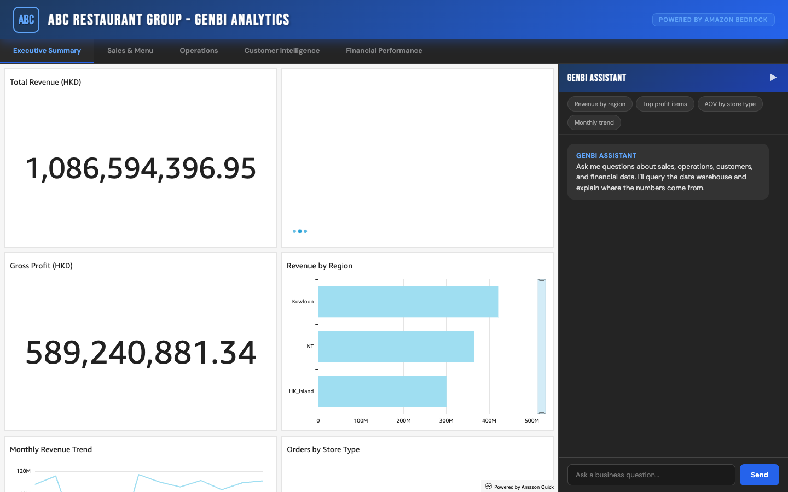
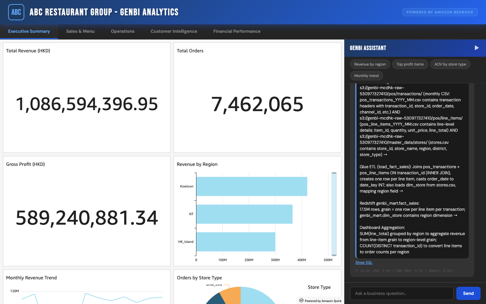
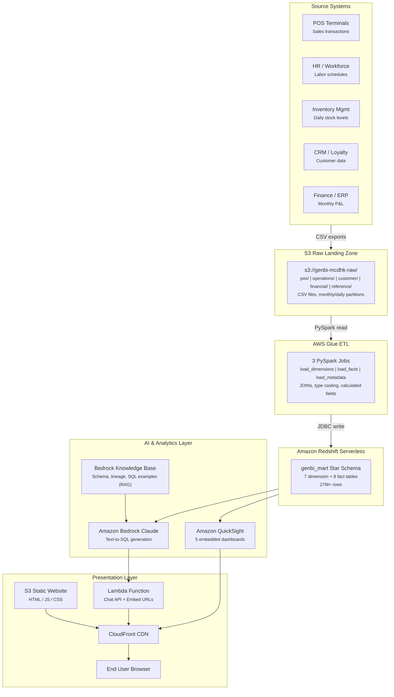

# BI Report Chatbot

## The Problem

Modern enterprises generate dashboards at scale — but more dashboards don't mean better decisions. Business users face three persistent challenges:

1. **Too many dashboards, too little insight** — Organizations often maintain dozens of dashboards across sales, operations, finance, and customer analytics. Finding the right dashboard for a specific question is a challenge in itself.
2. **Numbers without context** — A dashboard shows "Total Orders: 7,462,065" but doesn't explain what's included, what's excluded, or how the number was calculated. Is it line items or distinct transactions? Does it include voided orders? Which stores are in scope?
3. **Opaque data pipelines** — The journey from source system to dashboard metric involves multiple transformations (ETL jobs, JOINs, aggregations, filters). When a number looks wrong, tracing it back to the raw data requires tribal knowledge that lives in people's heads, not in the tool.

## The Solution

This platform solves all three problems by combining **interactive BI dashboards** with an **AI-powered chatbot** that answers business questions in plain English — and for every answer, traces the **complete data lineage** from source system to final metric.


*QuickSight dashboards with embedded GenBI chatbot — ask questions, get SQL-backed answers with full data lineage*


*Natural language question → SQL generation → Redshift query → results with end-to-end pipeline tracing*

### Key Capabilities

- **5 interactive dashboards** — Executive Summary, Sales & Menu, Operations, Customer Intelligence, Financial Performance
- **Natural language queries** — "What is the total revenue by region?" or "Which menu items have the highest profit margin?"
- **SQL-backed answers** — The chatbot generates SQL, queries Redshift, and returns tabular results with timing
- **End-to-end data lineage** — Every answer traces: Source System → S3 Raw → Glue ETL transforms → Redshift data mart → Dashboard aggregation
- **Smart dashboard routing** — The chatbot recommends the most relevant dashboard for each question
- **Topic guardrails** — The chatbot only responds to restaurant operations questions

---

## Architecture



> Open [`architecture-diagram.html`](architecture-diagram.html) locally in a browser for a detailed interactive version of this diagram.

---

## Technology Stack

| Layer | Service | Purpose |
|-------|---------|---------|
| **Frontend** | HTML5, CSS3, JavaScript, Chart.js | Dashboard UI, chat interface |
| **CDN** | Amazon CloudFront | Global content delivery, HTTPS |
| **Static Hosting** | Amazon S3 | HTML/JS/CSS files |
| **API Backend** | AWS Lambda + Function URL | Chat API, QuickSight embed URL generation |
| **AI/ML** | Amazon Bedrock (Claude) | Natural language to SQL generation |
| **Knowledge Base** | Amazon Bedrock KB | RAG retrieval for schema, lineage, SQL examples |
| **Data Warehouse** | Amazon Redshift Serverless | Star schema analytics (27M+ rows) |
| **ETL** | AWS Glue (PySpark) | S3 CSV to Redshift transformation |
| **Dashboards** | Amazon QuickSight | 5 embedded interactive dashboards |
| **Raw Storage** | Amazon S3 | CSV data files (POS, operations, financial, customer) |

---

## Project Structure

```
bi-report-chatbot/
├── embed/
│   └── index.html              # Main app — QuickSight dashboards + chat sidebar
├── genbi/
│   ├── api.py                  # Flask REST API (chat, QuickSight embed, health)
│   ├── agent.py                # AI agent: KB retrieval → SQL generation → Redshift query
│   ├── config.py               # Master config (stores, menu items, dates)
│   ├── etl/
│   │   ├── load_dimensions.py  # Glue job: S3 → Redshift dimension tables
│   │   ├── load_facts.py       # Glue job: S3 → Redshift fact tables
│   │   └── load_metadata.py    # Glue job: ETL registry, column lineage, data dictionary
│   ├── kb_docs/                # Knowledge base documents (indexed by Bedrock KB)
│   │   ├── 01_schema_overview.md
│   │   ├── 02_data_lineage.md
│   │   ├── 03_sql_examples.md
│   │   ├── 04_business_glossary.md
│   │   ├── 05_dashboard_catalog.md
│   │   └── 06_pipeline_lineage.md
│   ├── generate_*.py           # Synthetic data generators (see Data Generation below)
│   └── raw/                    # Generated data output (excluded from git, ~2.4 GB)
├── screenshots/                # System interface screenshots
├── sql/
│   ├── 01_schema_and_dimensions.sql
│   ├── 02_orders_data.sql
│   ├── 03_order_items_data.sql
│   └── 04_dashboard_queries.sql
├── index.html                  # Simple Chart.js dashboard (standalone)
├── app.js                      # Chart rendering & data aggregation
├── chat.js                     # Chat interface controller
├── architecture-diagram.html   # Visual system architecture (open locally in browser)
├── documentation.html          # Detailed project documentation
└── README.md
```

---

## Data Model

### Star Schema (genbi_mart)

**Dimension Tables** (7):
- `dim_date` — 365 rows (2023 calendar with HK holidays)
- `dim_store` — 200 stores across HK Island, Kowloon, New Territories
- `dim_menu_item` — 30 items in 8 categories with COGS and food cost %
- `dim_channel` — 5 order channels (counter, kiosk, mobile, delivery, drive-thru)
- `dim_payment_method` — 7 payment types (cash, Octopus, Visa, etc.)
- `dim_promotion` — 12 promotions run throughout 2023
- `dim_customer` — 50,000 loyalty program members

**Fact Tables** (8):
- `fact_sales` — 17.5M rows — transaction line items (revenue, COGS, gross profit)
- `fact_inventory` — 2.19M rows — daily stock levels, waste tracking
- `fact_labor` — 665K rows — employee shifts, labor costs, productivity
- `fact_service_performance` — 1.75M rows — hourly service times by channel
- `fact_customer_feedback` — 28K rows — CSAT ratings, sentiment, NPS
- `fact_loyalty` — 2.49M rows — points earned/redeemed, order values
- `fact_equipment` — 10K rows — maintenance events, downtime, repair costs
- `fact_financial` — 2.4K rows — monthly store P&L statements

---

## GenBI Chatbot — How It Works

```
User: "What is the total revenue by region?"
                    │
                    ▼
        ┌─── Bedrock Knowledge Base ───┐
        │  Retrieve schema, lineage,   │
        │  SQL examples via RAG        │
        └──────────┬───────────────────┘
                   ▼
        ┌─── Amazon Bedrock (Claude) ──┐
        │  Generate SQL query from     │
        │  natural language + context  │
        └──────────┬───────────────────┘
                   ▼
        ┌─── Redshift Data API ────────┐
        │  Execute SQL, return results │
        └──────────┬───────────────────┘
                   ▼
        Response with:
        - Query results (table)
        - Explanation
        - End-to-end data lineage
        - Recommended dashboard
        - SQL (expandable)
```

### Data Lineage Example

For every answer, the chatbot traces the full pipeline:

> **Source System**: POS terminals (store registers) →
>
> **S3 Raw Landing**:
> s3://.../pos/transactions/ (monthly CSV with transaction headers) AND
> s3://.../pos/line_items/ (line-level details: item, quantity, price) →
>
> **Glue ETL** (load_fact_sales): Joins transactions + line_items ON transaction_id, calculates gross_profit = line_total - discount - COGS →
>
> **Redshift** genbi_mart.fact_sales:
> 17.5M rows, grain = one row per line item per transaction →
>
> **Dashboard Aggregation**:
> COUNT(DISTINCT transaction_id) to convert line-item grain to order count

### Topic Guardrails

The chatbot only responds to restaurant operations questions. Off-topic queries (politics, weather, coding, etc.) receive a polite redirect.

---

## QuickSight Dashboards

| Dashboard | Key Metrics | Data Sources |
|-----------|-------------|--------------|
| **Executive Summary** | Total revenue, orders, gross profit, regional breakdown, monthly trend | fact_sales + dim_date + dim_store |
| **Sales & Menu** | Revenue by category, top items, channel mix, payment methods, hourly pattern | fact_sales + dim_menu_item + dim_channel + dim_payment_method |
| **Operations** | Labor cost, staffing efficiency, shift productivity, hours/shift | fact_labor + dim_store + dim_date |
| **Customer Intelligence** | CSAT rating, NPS, sentiment, recommendation rate, by region | fact_customer_feedback + dim_store |
| **Financial Performance** | EBITDA, net profit, margins, cost breakdown, monthly P&L | fact_financial + dim_store + dim_date |

---

## Data Generation

> **Important for source code users**: The `genbi/raw/` directory is excluded from this repository (~2.4 GB). You must generate the raw data locally before running the ETL pipeline or loading data into Redshift.

### Step 1: Generate Raw Data

```bash
cd bi-report-chatbot

# Generate POS transaction data (transactions + line items)
python3 generate_data.py

# Generate detailed POS data (monthly partitions)
cd genbi
python3 generate_pos.py

# Generate operations data (inventory, labor, service times, equipment)
python3 generate_operations.py

# Generate market and financial data (competitor pricing, store P&L)
python3 generate_market_financial.py

# Generate customer data (profiles, feedback, loyalty)
python3 generate_customer.py

# Generate reference data (stores, menu items, channels, payments, promotions)
python3 generate_reference.py
```

### Step 2: Upload to S3

```bash
# Upload generated data to your S3 bucket
aws s3 sync genbi/raw/ s3://YOUR-BUCKET-NAME/ --exclude "*.DS_Store"
```

### Step 3: Run Glue ETL

Upload the scripts from `genbi/etl/` to your Glue jobs and execute them to load the data into Redshift.

### Data Characteristics

All data is synthetically generated with seed 42 (fully reproducible). Realistic patterns include:
- Seasonal variation (summer tourism, winter holidays, typhoon season)
- Geographic variation (income by district, foot traffic)
- Temporal patterns (lunch/dinner peaks, weekend spikes)
- Supply chain volatility (typhoon impact on reliability)
- Equipment failures (ice cream machines break more frequently)

---

## Deployment

### Prerequisites
- AWS Account with Redshift Serverless, Bedrock, QuickSight, Glue enabled
- Python 3.9+
- AWS CLI configured

### Quick Start (Local Development)
```bash
# Clone the repo
git clone https://github.com/danielpeggy/bi-report-chatbot.git
cd bi-report-chatbot

# Generate raw data first (see Data Generation section above)

# Install Python dependencies
pip install flask flask-cors boto3

# Start the API server
cd genbi
python3 api.py
# Server runs at http://localhost:5001

# Open dashboard in browser
open http://localhost:5001
```

### Production Deployment (AWS)
1. **Redshift**: Create serverless workgroup, run SQL scripts from `sql/`
2. **S3**: Upload raw data to S3 bucket
3. **Glue**: Upload ETL scripts from `genbi/etl/`, create and run jobs
4. **Bedrock KB**: Create knowledge base, point to `kb_docs/` in S3
5. **QuickSight**: Create 5 dashboards, configure embedding
6. **Lambda**: Package `agent.py` + dependencies as Lambda function
7. **S3 + CloudFront**: Upload static files, configure distribution

See [`documentation.html`](documentation.html) for detailed step-by-step instructions.

---

## License

This project is provided as a reference implementation for AI-powered BI platforms on AWS.
