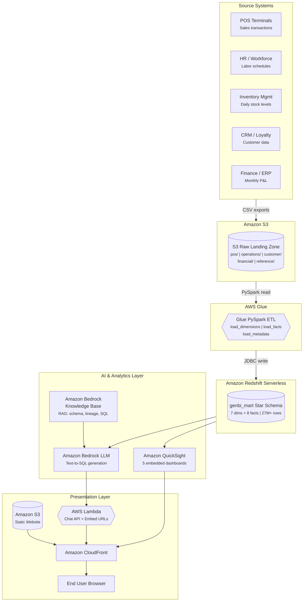
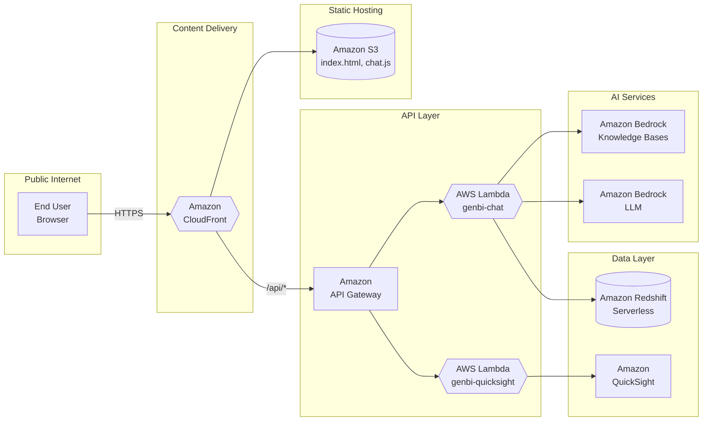
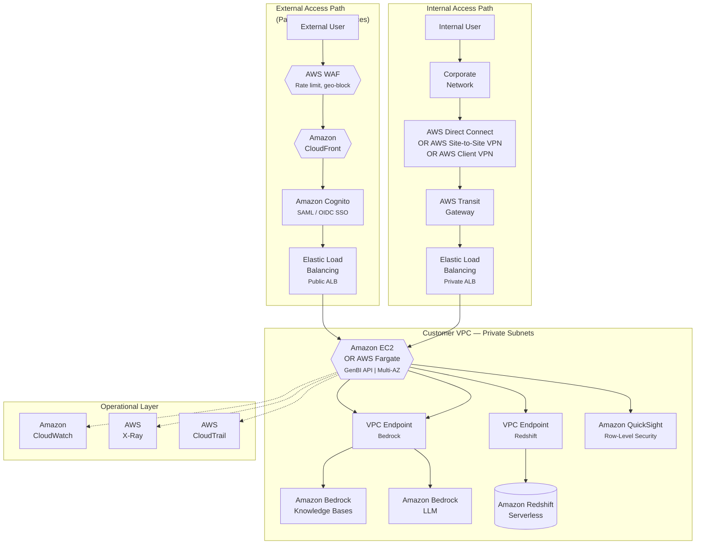

# BI Report Chatbot

## The Problem

Modern enterprises generate dashboards at scale — but more dashboards don't mean better decisions. Business users face three persistent challenges:

1. **Too many dashboards, too little insight** — Organizations often maintain dozens of dashboards across sales, operations, finance, and customer analytics. Finding the right dashboard for a specific question is a challenge in itself.
2. **Numbers without context** — A dashboard shows "Total Orders: 7,462,065" but doesn't explain what's included, what's excluded, or how the number was calculated. Is it line items or distinct transactions? Does it include voided orders? Which stores are in scope?
3. **Opaque data pipelines** — The journey from source system to dashboard metric involves multiple transformations (ETL jobs, JOINs, aggregations, filters). When a number looks wrong, tracing it back to the raw data requires tribal knowledge that lives in people's heads, not in the tool.

## The Solution

This platform solves all three problems by combining **interactive BI dashboards** with an **AI-powered chatbot** that answers business questions in plain English — and for every answer, traces the **complete data lineage** from source system to final metric.


*QuickSight dashboards with embedded GenBI chatbot — ask questions, get SQL-backed answers with full data lineage*


*Natural language question → SQL generation → Redshift query → results with end-to-end pipeline tracing*

### Key Capabilities

- **5 interactive dashboards** — Executive Summary, Sales & Menu, Operations, Customer Intelligence, Financial Performance
- **Natural language queries** — "What is the total revenue by region?" or "Which menu items have the highest profit margin?"
- **SQL-backed answers** — The chatbot generates SQL, queries Redshift, and returns tabular results with timing
- **End-to-end data lineage** — Every answer traces: Source System → S3 Raw → Glue ETL transforms → Redshift data mart → Dashboard aggregation
- **Smart dashboard routing** — The chatbot recommends the most relevant dashboard for each question
- **Topic guardrails** — The chatbot only responds to restaurant operations questions

---

## Architecture



> Open [`architecture-diagram.html`](architecture-diagram.html) locally in a browser for a detailed interactive version of this diagram.

### Technology Stack

| Layer | AWS Service | Purpose |
|-------|------------|---------|
| **Frontend** | HTML5, CSS3, JavaScript | Dashboard UI, chat interface |
| **CDN** | Amazon CloudFront | Global content delivery, HTTPS |
| **Static Hosting** | Amazon S3 | HTML/JS/CSS files |
| **API Backend** | AWS Lambda + Amazon API Gateway | Chat API, QuickSight embed URL generation |
| **AI/ML** | Amazon Bedrock | Natural language to SQL generation (model-agnostic) |
| **Knowledge Base** | Amazon Bedrock Knowledge Bases + Amazon OpenSearch Serverless | RAG retrieval for schema, lineage, SQL examples |
| **Data Warehouse** | Amazon Redshift Serverless | Star schema analytics (27M+ rows) |
| **ETL** | AWS Glue (PySpark) | S3 CSV to Redshift transformation |
| **Dashboards** | Amazon QuickSight | 5 embedded interactive dashboards |
| **Raw Storage** | Amazon S3 | CSV data files (POS, operations, financial, customer) |

---

## Getting Started

### Prerequisites

Before deploying, ensure the following are in place:

| Requirement | Details |
|-------------|---------|
| **AWS Account** | With IAM permissions for S3, Glue, Redshift, Bedrock, QuickSight, Lambda, API Gateway, CloudFront |
| **Amazon QuickSight** | Enterprise edition (required for dashboard embedding via `generate-embed-url-for-registered-user`) |
| **Amazon Bedrock** | Model access enabled in your region for your chosen LLM (e.g., Anthropic Claude, Amazon Titan, Meta Llama) |
| **Python 3.9+** | For data generation scripts and local Flask development |
| **pip packages** | `flask`, `flask-cors`, `boto3` (`pip install flask flask-cors boto3`) |
| **AWS CLI v2** | Configured with `aws configure` (access key, secret key, default region `us-east-1`) |

### Step 1: Clone Repository and Generate Raw Data

The `genbi/raw/` directory is excluded from this repository (~2.4 GB of synthetic data). You must generate it locally before proceeding.

```bash
# Clone the repository
git clone https://github.com/danielpeggy/bi-report-chatbot.git
cd bi-report-chatbot

# Install Python dependencies
pip install flask flask-cors boto3

# Generate legacy POS data (orders + order items)
python3 generate_data.py

# Generate all domain-specific data
cd genbi
python3 generate_pos.py              # POS transactions: pos_transactions_YYYY_MM.csv, pos_line_items_YYYY_MM.csv (12 months)
python3 generate_operations.py       # Inventory, labor shifts, service times, equipment maintenance
python3 generate_market_financial.py  # Competitor pricing, monthly store P&L statements
python3 generate_customer.py          # Customer profiles (50K), feedback surveys (28K), loyalty transactions
python3 generate_reference.py         # Reference data: 200 stores, 30 menu items, channels, payments, promotions
cd ..
```

All data uses seed 42 (fully reproducible). Generated files appear under `genbi/raw/` organized by domain: `pos/`, `operations/`, `customer/`, `financial/`, `reference/`.

### Step 2: Create S3 Bucket and Upload Raw Data

```bash
# Create a dedicated S3 bucket for raw data
aws s3 mb s3://YOUR-RAW-DATA-BUCKET --region us-east-1

# Upload all generated data (preserves folder structure)
aws s3 sync genbi/raw/ s3://YOUR-RAW-DATA-BUCKET/ --exclude "*.DS_Store"

# Verify upload — you should see subdirectories: pos/, operations/, customer/, financial/, reference/
aws s3 ls s3://YOUR-RAW-DATA-BUCKET/
```

### Step 3: Set Up Amazon Redshift Serverless

```bash
# 1. Create a Redshift Serverless namespace
aws redshift-serverless create-namespace \
  --namespace-name YOUR-NAMESPACE \
  --admin-username admin \
  --admin-user-password YOUR-PASSWORD \
  --db-name dev

# 2. Create a workgroup attached to the namespace
aws redshift-serverless create-workgroup \
  --workgroup-name YOUR-WORKGROUP \
  --namespace-name YOUR-NAMESPACE \
  --base-capacity 8

# 3. Create the genbi_mart schema and all tables
#    Run the DDL scripts from the sql/ directory using the Redshift Data API:
aws redshift-data execute-statement \
  --workgroup-name YOUR-WORKGROUP \
  --database dev \
  --sql "CREATE SCHEMA IF NOT EXISTS genbi_mart;"

# 4. Run the full schema creation (tables, constraints, indexes)
#    Copy the SQL from sql/01_schema_and_dimensions.sql and execute via Redshift Query Editor
#    or use the Data API for each statement
```

After this step, you should have the `genbi_mart` schema with 7 dimension tables and 8 fact tables (empty — data is loaded in Step 4).

### Step 4: Run AWS Glue ETL Jobs

Upload the PySpark scripts from [`genbi/etl/`](genbi/etl/) as Glue jobs. Each job reads from your S3 bucket and writes to Redshift.

```bash
# 1. Upload ETL scripts to S3 (Glue reads scripts from S3)
aws s3 cp genbi/etl/load_dimensions.py s3://YOUR-RAW-DATA-BUCKET/scripts/
aws s3 cp genbi/etl/load_facts.py s3://YOUR-RAW-DATA-BUCKET/scripts/
aws s3 cp genbi/etl/load_metadata.py s3://YOUR-RAW-DATA-BUCKET/scripts/

# 2. Create Glue jobs (via Console or CLI) with:
#    - IAM role with S3 read + Redshift write permissions
#    - Glue version 4.0 (Spark 3.3)
#    - Worker type: G.1X, Number of workers: 2
#    - Job parameters:
#      --S3_BUCKET: YOUR-RAW-DATA-BUCKET
#      --REDSHIFT_URL: jdbc:redshift://YOUR-WORKGROUP.ACCOUNT.REGION.redshift-serverless.amazonaws.com:5439/dev
#      --REDSHIFT_SCHEMA: genbi_mart

# 3. Run jobs in order (dimensions first, then facts, then metadata):
aws glue start-job-run --job-name load_dimensions  # ~2 min — loads 7 dimension tables
aws glue start-job-run --job-name load_facts        # ~15 min — loads 8 fact tables (27M+ rows)
aws glue start-job-run --job-name load_metadata     # ~1 min — loads ETL registry + data dictionary
```

| Job | Script | What It Loads | Duration |
|-----|--------|---------------|----------|
| **load_dimensions** | [`load_dimensions.py`](genbi/etl/load_dimensions.py) | 7 dimension tables (dim_date, dim_store, dim_menu_item, etc.) | ~2 min |
| **load_facts** | [`load_facts.py`](genbi/etl/load_facts.py) | 8 fact tables with JOINs, calculated fields (gross_profit, labor_cost_per_hour), type casting | ~15 min |
| **load_metadata** | [`load_metadata.py`](genbi/etl/load_metadata.py) | ETL registry, column-level lineage, data dictionary (used for governance) | ~1 min |

### Step 5: Set Up Amazon Bedrock Knowledge Base

The Knowledge Base gives the chatbot the context it needs (schema, lineage, SQL examples) via RAG retrieval.

```bash
# 1. Create a separate S3 bucket (or prefix) for KB documents
aws s3 sync genbi/kb_docs/ s3://YOUR-RAW-DATA-BUCKET/kb_docs/

# 2. In the AWS Console, go to Amazon Bedrock → Knowledge Bases → Create:
#    - Name: genbi-knowledge-base
#    - Data source: S3 bucket path s3://YOUR-RAW-DATA-BUCKET/kb_docs/
#    - Embedding model: Amazon Titan Embeddings V2 (or Cohere Embed)
#    - Vector store: Amazon OpenSearch Serverless (auto-created)
#    - Chunking strategy: Default (300 tokens with 20% overlap)
#
# 3. After creation, run a sync/ingestion job to index the 6 documents
# 4. Note the Knowledge Base ID (e.g., MYUSWRTES8) — you'll need it for configuration
```

The 6 KB documents in [`genbi/kb_docs/`](genbi/kb_docs/) contain:
- `01_schema_overview.md` — Table definitions, column types, join rules
- `02_data_lineage.md` — Calculated metric formulas, ETL schedule
- `03_sql_examples.md` — Pre-validated SQL patterns for common questions
- `04_business_glossary.md` — Business metric definitions, HK market context
- `05_dashboard_catalog.md` — Dashboard names, IDs, visual descriptions
- `06_pipeline_lineage.md` — End-to-end pipeline trace for every table

### Step 6: Set Up Amazon QuickSight Dashboards

```bash
# 1. Subscribe to QuickSight Enterprise (if not already)
#    AWS Console → QuickSight → Sign up → Enterprise edition

# 2. Create a Redshift data source in QuickSight:
#    QuickSight → Datasets → New dataset → Redshift (Manual connect)
#    - Connection name: genbi-redshift-ds
#    - Server: YOUR-WORKGROUP.ACCOUNT.REGION.redshift-serverless.amazonaws.com
#    - Port: 5439
#    - Database: dev
#    - Credentials: admin / YOUR-PASSWORD

# 3. Create 5 datasets using Custom SQL (one per dashboard):
#    - Executive: SELECT from fact_sales JOIN dim_date JOIN dim_store
#    - Sales & Menu: SELECT from fact_sales JOIN dim_menu_item JOIN dim_channel JOIN dim_payment_method
#    - Operations: SELECT from fact_labor JOIN dim_store JOIN dim_date
#    - Customer Intelligence: SELECT from fact_customer_feedback JOIN dim_store JOIN dim_date
#    - Financial: SELECT from fact_financial JOIN dim_store JOIN dim_date

# 4. Create 5 analyses → publish as dashboards with IDs:
#    genbi-exec-dashboard, genbi-sales-dashboard, genbi-ops-dashboard,
#    genbi-cust-dashboard, genbi-fin-dashboard

# 5. Enable embedding: QuickSight → Manage QuickSight → Domains and Embedding
#    Add your deployment domain (e.g., http://localhost:5001, https://your-cloudfront-domain)
```

### Step 7: Configure and Run the Application

Update the configuration in [`genbi/agent.py`](genbi/agent.py) and [`genbi/api.py`](genbi/api.py):

```python
# genbi/agent.py — update these values:
KB_ID = "YOUR-KB-ID"                          # From Step 5
MODEL_ID = "us.anthropic.claude-haiku-4-5-20251001-v1:0"  # Or any Bedrock-supported model
WORKGROUP = "YOUR-WORKGROUP"                   # From Step 3
DATABASE = "dev"
SCHEMA = "genbi_mart"

# genbi/api.py — update these values:
QS_ACCOUNT_ID = 'YOUR-AWS-ACCOUNT-ID'         # 12-digit AWS account ID
QS_USER_ARN = 'arn:aws:quicksight:us-east-1:ACCOUNT:user/default/YOUR-QS-USER'
```

```bash
# Start the local development server
cd genbi
python3 api.py

# Open http://localhost:5001 in your browser
# - QuickSight dashboards load in the main panel
# - GenBI chatbot is in the right sidebar
# - Try: "What is the total revenue by region?"
```

---

## Deployment Architectures (Demo Version)

### Demo Deployment — CloudFront + Lambda

The demo deployment is serverless and designed for quick setup — ideal for PoC presentations and stakeholder demos. It can be deployed to Amazon CloudFront for public access with minimal infrastructure.



| Aspect | Demo Setup |
|--------|-----------|
| **Access** | Public via CloudFront URL |
| **Compute** | AWS Lambda (serverless, pay-per-request) |
| **API** | Amazon API Gateway REST with Lambda proxy integration |
| **Auth** | None (open access) |
| **Network** | Public endpoints for all services |
| **Cost** | Near-zero when idle (Redshift Serverless + Lambda scale to zero) |

### Enterprise Deployment — VPC + Dual-Path Access (Recommended for Production)

For production deployments, the architecture adds **network isolation**, **authentication**, **dual-path access** (external + internal via Direct Connect / VPN), and **operational monitoring**. No data, dashboards, or chatbot responses are accessible to unauthorized users.



#### Dual Access Paths

| Aspect | External Path | Internal Path |
|--------|--------------|---------------|
| **Who** | Partners, executives, demo audiences | Internal analysts, operations staff |
| **Entry** | Internet → Amazon CloudFront + AWS WAF | Corporate network → AWS Direct Connect / VPN |
| **DNS** | `genbi.company.com` (public Route 53) | `genbi.internal.company.com` (Route 53 Private Hosted Zone) |
| **Load Balancer** | Public ALB (internet-facing) | Private ALB (internal only, no public IP) |
| **Auth** | Amazon Cognito with SAML/OIDC (corporate SSO) | Corporate AD / Kerberos (already authenticated on network) |
| **Protection** | AWS WAF rate-limiting, geo-blocking, OWASP rules | Security Groups + NACLs (trusted network) |

Both paths route to the **same EC2/Fargate compute layer** — no duplication of application infrastructure.

#### Internal Connectivity Options

| Option | Best For | Latency | Setup Time |
|--------|----------|---------|------------|
| **AWS Direct Connect** | HQ / regional offices with high traffic | Lowest (dedicated fiber) | Weeks (physical cross-connect) |
| **AWS Site-to-Site VPN** | Branch offices, DX backup | Low (encrypted over internet) | Hours (IPsec config) |
| **AWS Client VPN** | Remote workers / WFH analysts | Medium (per-user OpenVPN) | Minutes (certificate-based) |

All three terminate at an AWS Transit Gateway (or Virtual Private Gateway) attached to the customer VPC.

#### Enterprise Security Controls

| AWS Service / Control | Purpose |
|----------------------|---------|
| **VPC Endpoints** | Bedrock and Redshift traffic stays on AWS backbone — no internet exposure |
| **AWS KMS** | At-rest encryption for Redshift, S3, Bedrock KB, and CloudWatch Logs |
| **TLS Everywhere** | In-transit encryption: ALB → EC2, VPC endpoints, DX with MACsec |
| **QuickSight Row-Level Security** | Each user sees only their authorized region/store data |
| **AWS WAF** | Rate limiting, geo-blocking, OWASP managed rule sets |
| **AWS CloudTrail** | Full API audit log — who queried what, when |
| **AWS X-Ray** | End-to-end request tracing: KB retrieval → LLM → Redshift → response |
| **Amazon CloudWatch** | Metrics, alarms, dashboards for API latency and error rates |

---

## Technical Deep Dive

This section explains the internals of the GenBI chatbot — how the knowledge base is constructed, how RAG retrieval works, and why this approach is tool-agnostic. This section is for technical understanding and does not affect the deployment steps above.

### How the Chatbot Works

```
User: "What is the total revenue by region?"
                    │
                    ▼
        ┌─── Bedrock Knowledge Base ───┐
        │  Retrieve schema, lineage,   │
        │  SQL examples via RAG        │
        └──────────┬───────────────────┘
                   ▼
        ┌─── Amazon Bedrock LLM ───────┐
        │  Generate SQL query from     │
        │  natural language + context  │
        └──────────┬───────────────────┘
                   ▼
        ┌─── Redshift Data API ────────┐
        │  Execute SQL, return results │
        └──────────┬───────────────────┘
                   ▼
        Response with:
        - Query results (table)
        - General explanation
        - Recommended dashboard
        - End-to-end data lineage
        - SQL (expandable)
```

> **Model-agnostic design**: The LLM layer uses Amazon Bedrock, which supports multiple foundation models (Anthropic Claude, Amazon Titan, Meta Llama, Mistral, Cohere, AI21, etc.). The model can be swapped by changing a single `MODEL_ID` configuration — no code changes required.

### What Information Is Indexed in the Knowledge Base

The Knowledge Base is the brain that gives the LLM the context it needs to generate accurate SQL and meaningful explanations. It is built from **6 documents** in [`genbi/kb_docs/`](genbi/kb_docs/) that capture metadata from every stage of the data pipeline:

| KB Document | Pipeline Stage | What It Contains |
|-------------|---------------|------------------|
| [**01_schema_overview.md**](genbi/kb_docs/01_schema_overview.md) | Redshift | Table definitions, column names and types, primary/foreign keys, row counts, join rules (natural keys vs surrogate keys), grain of each fact table |
| [**02_data_lineage.md**](genbi/kb_docs/02_data_lineage.md) | Glue ETL + Redshift | How each calculated metric is derived (e.g., `gross_profit = line_total - cogs_amount - discount_amount`), ETL schedule, data freshness SLAs, known data characteristics |
| [**03_sql_examples.md**](genbi/kb_docs/03_sql_examples.md) | Redshift | Pre-validated SQL query patterns for common business questions — revenue by region, labor cost per order, waste rate by category, monthly P&L, etc. |
| [**04_business_glossary.md**](genbi/kb_docs/04_business_glossary.md) | Business Context | Business metric definitions (AOV, CSAT, NPS, EBITDA), Hong Kong market context (regions, payment methods, currency, tax rules, minimum wage) |
| [**05_dashboard_catalog.md**](genbi/kb_docs/05_dashboard_catalog.md) | QuickSight | Dashboard names, IDs, visual descriptions, which metrics each dashboard shows, which fact/dim tables feed each dashboard, and a recommendation guide mapping question topics to dashboards |
| [**06_pipeline_lineage.md**](genbi/kb_docs/06_pipeline_lineage.md) | All Stages (End-to-End) | For each fact table: source system origin → S3 raw file paths and column names → Glue ETL job name, JOINs, and transforms → Redshift target table and grain → dashboard aggregation functions |

### How RAG Retrieval Powers Each Response Area

When a user asks a question, the system uses **Retrieval-Augmented Generation (RAG)** in three steps:

**Step 1 — Vector Search**: The user's question is converted to a vector embedding and compared against the pre-indexed KB document chunks stored in Amazon OpenSearch Serverless. The top-K most relevant chunks are retrieved (e.g., asking about "total orders" retrieves schema info about `fact_sales`, the SQL example for `COUNT(DISTINCT transaction_id)`, and the pipeline lineage for POS data).

**Step 2 — Contextual Prompt Assembly**: The retrieved KB chunks are injected into the LLM prompt alongside the user's question and system instructions. This gives the LLM precise, verified context rather than relying on general training knowledge.

**Step 3 — Structured Generation**: The LLM generates a structured JSON response with five fields, each informed by different KB documents:

| Response Area | What the LLM Generates | KB Documents Used |
|---------------|------------------------|-------------------|
| **SQL Query** | Syntactically correct Redshift SQL with proper JOINs, aggregations, and filters | [`01_schema_overview`](genbi/kb_docs/01_schema_overview.md) (table/column names, join keys), [`03_sql_examples`](genbi/kb_docs/03_sql_examples.md) (validated patterns) |
| **General Explanation** | Plain-English description of what the query does and what the results mean | [`04_business_glossary`](genbi/kb_docs/04_business_glossary.md) (metric definitions, benchmarks, HK market context) |
| **Recommended Dashboard** | Which of the 5 QuickSight dashboards best visualizes this data | [`05_dashboard_catalog`](genbi/kb_docs/05_dashboard_catalog.md) (dashboard-to-topic mapping) |
| **Data Lineage** | End-to-end pipeline trace from source system to final aggregated number | [`06_pipeline_lineage`](genbi/kb_docs/06_pipeline_lineage.md) (source systems, S3 paths, Glue transforms, table grain), [`02_data_lineage`](genbi/kb_docs/02_data_lineage.md) (calculated field formulas) |
| **Assumptions** | Any assumptions made about ambiguous questions | [`04_business_glossary`](genbi/kb_docs/04_business_glossary.md) (e.g., "revenue" means `line_total` not `gross_profit`) |

### Data Lineage Example

For every answer, the chatbot traces the full pipeline:

> **Source System**: POS terminals (store registers) →
>
> **S3 Raw Landing**:
> s3://.../pos/transactions/ (monthly CSV with transaction headers) AND
> s3://.../pos/line_items/ (line-level details: item, quantity, price) →
>
> **Glue ETL** (load_fact_sales): Joins transactions + line_items ON transaction_id, calculates gross_profit = line_total - discount - COGS →
>
> **Redshift** genbi_mart.fact_sales:
> 17.5M rows, grain = one row per line item per transaction →
>
> **Dashboard Aggregation**:
> COUNT(DISTINCT transaction_id) to convert line-item grain to order count

### Tool-Agnostic Design

The knowledge base approach is **not tied to any specific ETL or BI tool**. The KB documents capture metadata — schema definitions, transformation logic, lineage, and dashboard catalogs — that can be extracted from any enterprise data stack:

| This Project Uses | Can Be Replaced With | KB Documents Still Apply |
|-------------------|---------------------|--------------------------|
| **AWS Glue** (ETL) | Informatica, dbt, Talend, Azure Data Factory, Apache Airflow | [`02_data_lineage.md`](genbi/kb_docs/02_data_lineage.md), [`06_pipeline_lineage.md`](genbi/kb_docs/06_pipeline_lineage.md) — document transforms regardless of the tool |
| **Amazon Redshift** (Data Warehouse) | Snowflake, BigQuery, Azure Synapse, Databricks SQL | [`01_schema_overview.md`](genbi/kb_docs/01_schema_overview.md), [`03_sql_examples.md`](genbi/kb_docs/03_sql_examples.md) — adapt SQL dialect as needed |
| **Amazon QuickSight** (BI) | Power BI, Tableau, Looker, Apache Superset | [`05_dashboard_catalog.md`](genbi/kb_docs/05_dashboard_catalog.md) — document which dashboards show which metrics |
| **Amazon Bedrock** (LLM) | Azure OpenAI, Google Vertex AI, self-hosted models | Swap the LLM API call — the KB and prompt structure remain the same |

The key insight is: **the value is in the metadata documentation, not the specific tools.** Any organization that documents its schema, transformation logic, and dashboard catalog in structured markdown can enable the same AI-powered Q&A experience over their data.

### Topic Guardrails

The chatbot only responds to restaurant operations questions. Off-topic queries (politics, weather, coding, etc.) receive a polite redirect.

---

## Data Model

### Star Schema (genbi_mart)

**Dimension Tables** (7):
- `dim_date` — 365 rows (2023 calendar with HK holidays)
- `dim_store` — 200 stores across HK Island, Kowloon, New Territories
- `dim_menu_item` — 30 items in 8 categories with COGS and food cost %
- `dim_channel` — 5 order channels (counter, kiosk, mobile, delivery, drive-thru)
- `dim_payment_method` — 7 payment types (cash, Octopus, Visa, etc.)
- `dim_promotion` — 12 promotions run throughout 2023
- `dim_customer` — 50,000 loyalty program members

**Fact Tables** (8):
- `fact_sales` — 17.5M rows — transaction line items (revenue, COGS, gross profit)
- `fact_inventory` — 2.19M rows — daily stock levels, waste tracking
- `fact_labor` — 665K rows — employee shifts, labor costs, productivity
- `fact_service_performance` — 1.75M rows — hourly service times by channel
- `fact_customer_feedback` — 28K rows — CSAT ratings, sentiment, NPS
- `fact_loyalty` — 2.49M rows — points earned/redeemed, order values
- `fact_equipment` — 10K rows — maintenance events, downtime, repair costs
- `fact_financial` — 2.4K rows — monthly store P&L statements

### QuickSight Dashboards

| Dashboard | Key Metrics | Data Sources |
|-----------|-------------|--------------|
| **Executive Summary** | Total revenue, orders, gross profit, regional breakdown, monthly trend | fact_sales + dim_date + dim_store |
| **Sales & Menu** | Revenue by category, top items, channel mix, payment methods, hourly pattern | fact_sales + dim_menu_item + dim_channel + dim_payment_method |
| **Operations** | Labor cost, staffing efficiency, shift productivity, hours/shift | fact_labor + dim_store + dim_date |
| **Customer Intelligence** | CSAT rating, NPS, sentiment, recommendation rate, by region | fact_customer_feedback + dim_store |
| **Financial Performance** | EBITDA, net profit, margins, cost breakdown, monthly P&L | fact_financial + dim_store + dim_date |

---

## Project Structure

```
bi-report-chatbot/
├── embed/
│   └── index.html              # Main app — QuickSight dashboards + chat sidebar
├── lambda/
│   ├── genbi_chat.py           # Lambda: KB retrieval → SQL generation → Redshift query
│   └── genbi_quicksight.py     # Lambda: QuickSight embed URL generation
├── genbi/
│   ├── api.py                  # Flask REST API (chat, QuickSight embed, health)
│   ├── agent.py                # AI agent: KB retrieval → SQL generation → Redshift query
│   ├── config.py               # Master config (stores, menu items, dates)
│   ├── etl/                    # AWS Glue PySpark ETL scripts
│   │   ├── load_dimensions.py  # Glue job: S3 → Redshift dimension tables
│   │   ├── load_facts.py       # Glue job: S3 → Redshift fact tables
│   │   └── load_metadata.py    # Glue job: ETL registry, column lineage, data dictionary
│   ├── kb_docs/                # Knowledge base documents (indexed by Bedrock KB)
│   │   ├── 01_schema_overview.md
│   │   ├── 02_data_lineage.md
│   │   ├── 03_sql_examples.md
│   │   ├── 04_business_glossary.md
│   │   ├── 05_dashboard_catalog.md
│   │   └── 06_pipeline_lineage.md
│   ├── generate_*.py           # Synthetic data generators
│   └── raw/                    # Generated data output (excluded from git, ~2.4 GB)
├── screenshots/                # System interface screenshots
├── sql/                        # Redshift DDL and sample queries
├── index.html                  # Simple Chart.js dashboard (standalone)
├── app.js                      # Chart rendering & data aggregation
├── chat.js                     # Chat interface controller
├── architecture-diagram.html   # Visual system architecture (open locally in browser)
├── documentation.html          # Detailed project documentation
└── README.md
```

---

## License

This project is provided as a reference implementation for AI-powered BI platforms on AWS.
